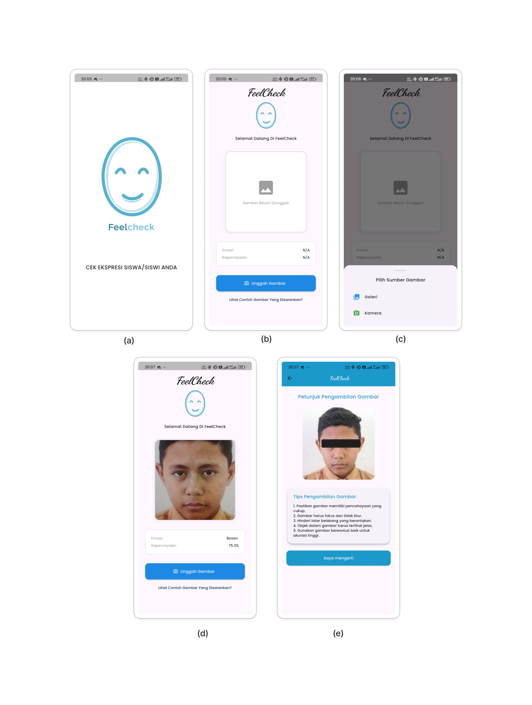

# 📱 FeelCheck

FeelCheck adalah aplikasi **klasifikasi ekspresi wajah** berbasis Flutter dengan model **TensorFlow Lite**.  
Aplikasi ini menggunakan dataset **USK FEMO** yang berisi 5 kelas ekspresi wajah:

- 😀 Senang
- 😢 Sedih
- 😠 Marah
- 😲 Terkejut
- 😐 Bosan

---

## ✨ Fitur Utama

- 📷 **Klasifikasi wajah** melalui kamera.
- 🤖 **Klasifikasi ekspresi** menjadi 5 kelas.
- 🖼️ **Deteksi wajah dari gambar** yang diunggah.
- 📊 Menampilkan **nilai confidence** hasil prediksi.
- 🗂️ **Riwayat deteksi** ekspresi wajah.
- 🎨 Antarmuka modern & ringan.

---

## 🛠️ Teknologi yang Digunakan

- **Flutter** – Framework UI
- **TensorFlow Lite** – Model deep learning
- **tflite_flutter** – Plugin inferensi TFLite di Flutter
- **camera** – Streaming kamera
- **permission_handler** – Izin kamera dan penyimpanan
- **path_provider** – Akses direktori lokal
- **flutter_svg** – Menampilkan ilustrasi SVG

---

## 📦 Instalasi

1. **Clone repositori**
   ```bash
   git clone https://github.com/dimaswahy/FeelCheck-App-Ekspresion-Klasification.git
   cd FeelCheck-App-Ekspresion-Klasification

   flutter pub get

   flutter run

---

## 📸 Cuplikan Layar



---

## 🧠 Model AI
Model deep learning yang digunakan dilatih dengan dataset USK FEMO:

Arsitektur: MobileNet

Format: .tflite

Kelas Output:

1. Senang

2. Sedih

3. Marah

4. erkejut

5. Bosan

Model diekspor ke TensorFlow Lite untuk performa tinggi di perangkat mobile.

---

## APK Release
Link Download : ...


---


## 👨‍💻 Pengembang
- Nama: Dimas Wahyu Nugraha

- Email: ....@gmail.com

- LinkedIn: https://www.linkedin.com/in/dimas-wahyu-nugraha-99518a194/

# FeelCheck-App-Ekspresion-Klasification